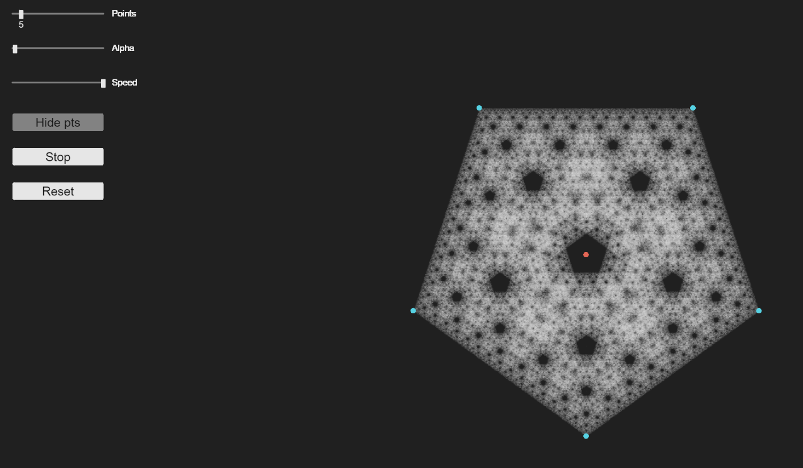

# js-sierpinski_polygon
This is a proyect wicth draws the sierpinski triagle by starting from a point and allways going to the middle point between the actual point and a point of the polygon chosen randomly I built using <a href="https://p5js.org/">p5.js</a>.
## URL
This proyect is hosted by github pages at <a href="https://pabloqb2000.github.io/js-sierpinski_polygon/">this link</a>.
## Options
#### Draggable points
  - The red point is the starting point of the algorithm
  - The blue point are are points of the polygon
#### Number of points
Number of points in the polygon
#### Alpha
Alpha channel of each drawn point
#### Speed
Speed at wich the triangle is drawn
#### Hide pts
Whether to hide the draggable points
#### Stop
Whether to stop or resume the algorithm
#### Reset
Reset the drawing
## Screenshot
</img>
## References
To find more information about the <b>awesome</b> library used for this proyect visit:
<a href="https://p5js.org/"> https://p5js.org/ </a>
